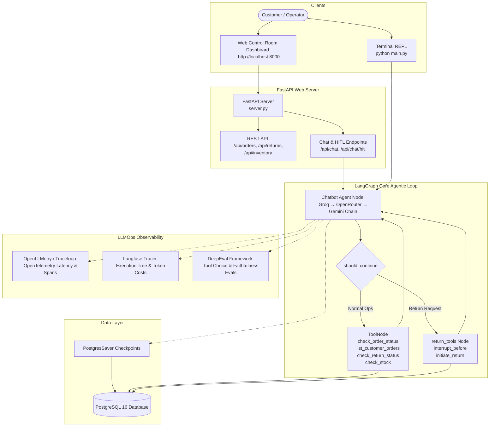

# CommerceCortex

**Stateful AI Operations Agent, Control Room Dashboard & LLMOps Observability Reference Architecture**

[](https://www.python.org/downloads/)
[](https://github.com/langchain-ai/langgraph)
[](https://www.postgresql.org/)
[](https://fastapi.tiangolo.com/)
[](#3-tier-llmops-observability-stack)

An autonomous, multi-tool AI agent built with **LangGraph**, **PostgreSQL**, and **FastAPI** that handles real e-commerce operations — order tracking, customer order history, returns & escalation (with Human-in-the-Loop approval), and inventory stock intelligence.

CommerceCortex features an interactive **Web Application & Control Room Dashboard**, an **Interactive Human-in-the-Loop (HITL) Approval System**, and an enterprise **3-Tier LLMOps Observability Stack**.

---

## Architecture Overview



Detailed technical specifications and ER diagrams are available in [docs/architecture.md](./docs/architecture.md).

---

## Core Capabilities

| Feature | Description |
|---------|-------------|
| **Stateful Memory** | PostgreSQL checkpointing (`PostgresSaver`) preserves conversation context across sessions |
| **5 SQL-Backed Tools** | Parameterized SQL queries for orders, customer order history, returns, and inventory stock |
| **Human-in-the-Loop (HITL)** | Return requests trigger `interrupt_before` state pauses requiring explicit operator approval |
| **LLM Fallback Chain** | Auto-failover across **Groq (`llama-3.3-70b-versatile`)**, **OpenRouter**, and **Google Gemini** |
| **Web Control Room** | Interactive Web Dashboard (`http://localhost:8000`) with live database tables & HITL popups |
| **3-Tier LLMOps Observability** | Integrated **OpenLLMetry** (OTel spans), **Langfuse** (execution trees), and **DeepEval** (CI/CD evals) |
| **SQL Security & Safety** | 100% parameterized `psycopg3` `%s` placeholders and input regex validation |

---

## 3-Tier LLMOps Observability Stack

CommerceCortex implements a production LLMOps architecture inspired by industry standards ([lamhotsiagian/llm-ops-observability](https://github.com/lamhotsiagian/llm-ops-observability)):

### Pillar 1: Execution Tracing & Session Replay (Langfuse)
- Captures full graph step execution trees, token usage, dollar costs, and session replays.
- Configure `LANGFUSE_PUBLIC_KEY` and `LANGFUSE_SECRET_KEY` in `.env` to enable cloud/self-hosted tracing.

### Pillar 2: OpenTelemetry Performance Spans (OpenLLMetry / Traceloop)
- Auto-instruments LangChain and LangGraph to generate standard OpenTelemetry (OTel) traces.
- Tracks 95th/99th percentile latency across LLM invocations and PostgreSQL queries.
- Runs in local OTel export mode out-of-the-box, or set `TRACELOOP_API_KEY` for cloud export.

### Pillar 3: Continuous Agent Evaluation (DeepEval)
- Automated unit test suite verifying tool selection accuracy, faithfulness to SQL data, and HITL safety constraints.
- Run the benchmark suite locally or in CI/CD pipelines:
  ```bash
  PYTHONPATH=. ./venv/bin/pytest evals/test_agent_evals.py -v
  ```

---

## Quick Start

### 1. Docker Setup (Recommended)

```bash
# 1. Copy environment template
cp .env.example .env
# Edit .env and set your GROQ_API_KEY

# 2. Start PostgreSQL database & initialize schema
docker-compose up -d db
docker-compose run app python db/init_db.py

# 3. Launch Web Server & Control Room Dashboard
docker-compose up -d app
# Open http://localhost:8000 in your browser!
```

### 2. Local Development Setup

**Prerequisites:** Python 3.11+, PostgreSQL 15+

```bash
# 1. Create and activate virtual environment
python3 -m venv venv
source venv/bin/activate

# 2. Install dependencies
pip install -r requirements.txt

# 3. Configure environment
cp .env.example .env
# Edit .env — set GROQ_API_KEY and DB_URI

# 4. Initialize PostgreSQL schema and seed data
python db/init_db.py

# 5. Run FastAPI Web Server & Control Room
uvicorn server:app --reload --port 8000
# Or run CLI terminal REPL: python main.py
```

---

## Tools Reference

| Tool Name | Description | Example Input | Target Table |
|-----------|-------------|---------------|--------------|
| `check_order_status` | Look up status, location, and delivery notes by Order ID | `order_id: "ORD-101"` | `orders` |
| `list_customer_orders` | List all recent orders for a customer by Customer ID | `customer_id: "CUST-001"` | `orders` |
| `check_return_status` | Check if a return request exists for an order | `order_id: "ORD-103"` | `returns` |
| `initiate_return` | File a return request (**requires HITL operator approval**) | `order_id: "ORD-107", reason: "Defective"` | `returns` |
| `check_stock` | Query inventory stock levels and restock ETAs | `item_name: "Gaming Laptop"` | `inventory` |

---

## Database Schema (PostgreSQL 16)

CommerceCortex manages e-commerce operations across three normalized tables:

* **`orders`**: Customer order records (`order_id`, `customer_id`, `item`, `status`, `location`, `notes`, `created_at`).
* **`returns`**: Return requests (`return_id`, `order_id`, `reason`, `status`, `escalated`, `notes`, `created_at`).
* **`inventory`**: Product stock levels (`item_name`, `sku`, `stock_qty`, `warehouse`, `restock_eta`).

*Note: LangGraph `PostgresSaver` automatically manages state checkpoint tables (`checkpoints`, `checkpoint_blobs`, `checkpoint_writes`).*

---

## Project Structure

```
commerce_cortex/
├── server.py                # FastAPI Web Server & REST/HITL API Gateway
├── main.py                  # CLI Terminal REPL & LangGraph Graph Builder
├── config.py                # Env validation, LLM factory, system prompt
├── tools.py                 # 5 SQL-backed @tool functions with parameterized SQL
├── observability.py         # OpenLLMetry OTel tracing & Langfuse tracer module
├── static/
│   └── index.html           # Web App UI & Ops Control Room Dashboard
├── evals/
│   └── test_agent_evals.py # DeepEval test suite (Tool Choice, Faithfulness, HITL Safety)
├── db/
│   ├── schema.sql           # PostgreSQL table definitions with constraints
│   ├── seed.sql             # Demo seed data (idempotent)
│   └── init_db.py           # Database initialization & checkpointer setup
├── docs/
│   ├── architecture.md      # Detailed system architecture & Mermaid diagrams
│   ├── setup.md             # Expanded setup & troubleshooting guide
│   └── STATUS.md            # Project handoff status
├── .env.example             # Environment variable template
├── docker-compose.yml       # Postgres 16 + Web app services
├── Dockerfile               # Python 3.12-slim application container
├── requirements.txt         # Pinned Python dependencies
└── AGENTS.md                # Agent development rules
```

---

## Example Interactive Session

```
=== Welcome to CommerceCortex ===
Session started. Thread ID: a3f8c2d1
Commands: /new (new thread), /thread (show ID), /quit (exit)

You: Can you check the status of ORD-101?
Agent: Order ORD-101 (Gaming Laptop)
  Customer: CUST-001
  Status:   Shipped
  Location: Berlin Hub
  Notes:    Requires signature on delivery

You: I want to return ORD-107, the headphones are defective.
Agent: I'll file a return for order ORD-107. Let me confirm:
  Order: ORD-107 (Noise-Cancelling Headphones)
  Reason: Defective headphones

⚠️  Pending action: Initiate Return
Order ID: ORD-107 | Reason: Defective headphones
⚠️  Approve this return? (y/n): y
Action approved. Resuming...
Agent: ✅ Return RET-004 initiated for Noise-Cancelling Headphones (order ORD-107).
  Reason: Defective headphones
  Status: Pending human approval.

You: Do you have mechanical keyboards in stock?
Agent: Mechanical Keyboard [SKU-MK-002]
  Stock:     OUT OF STOCK (Restock ETA: 2026-08-01)
  Warehouse: Warehouse A
```
